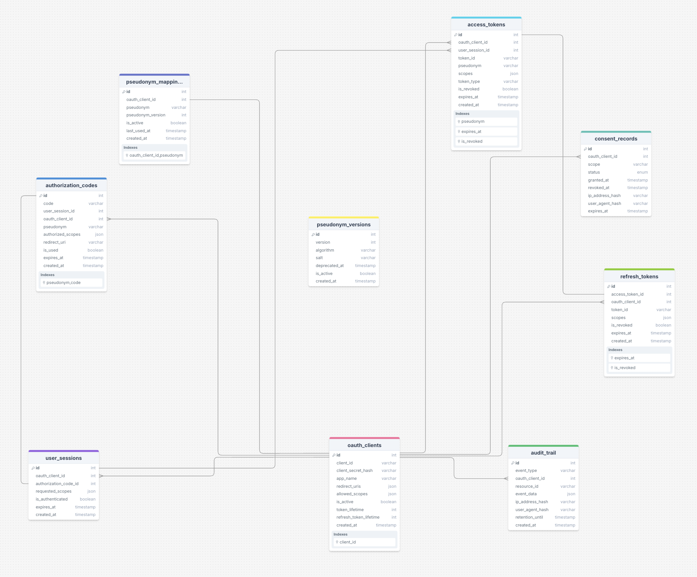

# Entity Relationship Diagram

https://drawsql.app/teams/drunkgiantbird/diagrams/consentkeys-database-schema

## OAuth2/OIDC Flow Support
The schema supports the OAuth2/OIDC specification:

Authorization Code Flow: `authorization_codes` table handles the initial auth code generation and exchange
Token Management: `access_tokens` and `refresh_tokens` tables manage the complete token lifecycle
Session Management: `user_sessions` tracks authenticated sessions with proper expiration
Client Management: `oauth_clients` stores registered applications with their configurations

## Consent Management
The `consent_records` table provides granular consent tracking:

Scope-based permissions: Links specific scopes to user-client combinations
Temporal tracking: Records when consent was granted and last updated
Revocation support: `is_revoked` flag enables consent withdrawal
Audit trail: Timestamps provide compliance evidence

## Session and Token Lifecycle
The design implements proper token lifecycle management:

Expiration tracking: All tokens have expires_at timestamps
Session correlation: Tokens are linked to specific user sessions
Refresh capability: Refresh tokens enable seamless token renewal
Cleanup support: Expired tokens can be systematically removed

## Technical Decisions
Separation of Concerns: The schema separates authentication (sessions), authorization (tokens), and consent (records), following OAuth2 best practices.
Pseudonym Versioning: The `pseudonym_versions` table supports algorithm updates, allowing cryptographic evolution without breaking existing integrations.

## Performance Optimization Strategies
Indexing Strategy:

`client_id` and `pseudonym` combinations for fast user lookups
`expires_at` timestamps for efficient cleanup operations
`is_active` and `is_revoked` flags for quick validity checks

Batch Operations: The design supports efficient batch cleanup of expired tokens and sessions through timestamp-based queries.
Caching Opportunities: Pseudonym mappings and client configurations can be cached for performance.

## Data Cleanup and Retention
Automated Cleanup: The consistent use of expires_at timestamps enables automated cleanup of expired data.
Audit Requirements: The `audit_trail` table maintains compliance records while allowing operational data cleanup.
Retention Policies: Different retention periods can be applied to different data types (tokens vs. audit logs).

## Edge Cases

The design handles client lifecycle changes through:

Soft deletion: Client apps can be deactivated rather than deleted
Cascade cleanup: When clients are removed, associated tokens and sessions can be cleaned up
Migration support: The versioning system allows for smooth transitions during client updates

Consent Revocation and Audit Requirements
The system supports comprehensive consent management:

Granular revocation: Users can revoke specific scopes or entire client access
Audit compliance: All consent changes are tracked with timestamps
Immediate effect: Revoked consents can immediately invalidate associated tokens

Pseudonym Algorithm Updates
The `pseudonym_versions` table enables algorithm evolution:

Backward compatibility: Old pseudonyms remain valid during migration periods
Gradual migration: New pseudonyms can be generated with updated algorithms
Rollback capability: Previous versions can be restored if needed